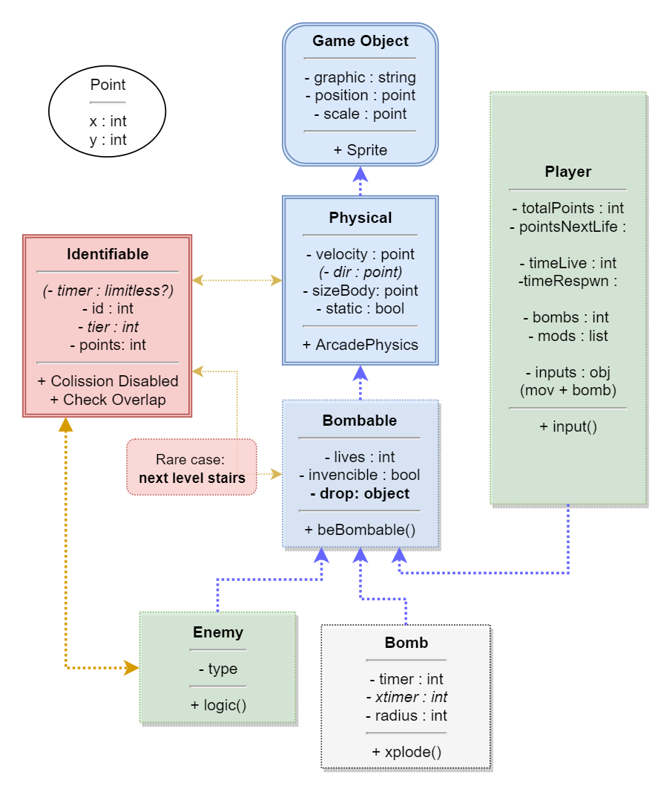

# Planificacion

Very close to final implementation:

- [Planificacion](#planificacion)
    - [Historias de usuario](#historias-de-usuario)
        - [Hechas](#hechas)
    - [Planificación](#planificaci%C3%B3n)
        - [Semana 1](#semana-1)
        - [Semana 2](#semana-2)
        - [Semana 3](#semana-3)
        - [Semana 4](#semana-4)
        - [Semana 5](#semana-5)
        - [Semana 6](#semana-6)
        - [Semana 7](#semana-7)
        - [Semana 8](#semana-8)
        - [Semana 9](#semana-9)

## Historias de usuario

### Hechas
- Movimiento del jugador
    - Cualquier input disponible (dos direcciones a la vez etc)
    - Movimiento encarrilado del personaje
- Colisiones del jugador con los muros
- Creación de los muros (iterativo/provisional)
- Creación y destrucción de bombas
    - Sin explosion
- Ajuste de sprites a pantalla
- Creación del jugador
    - N jugadores posibles (te quedas sin teclado)
- Ajuste de código a diagrama de clases (herencia)
- Concretados las mecanicas tecnicas del gameplay en diseño.md
    - Asi como tambien su implementacion

- Concretar todos los atributos y metodos de las clases
    - Segun la implementacion de diseño.md (maybe not?)
        - Añade muchos metodos posibles - quizas no los necesitamos
    - Cambiar nuestro "point" por phaser.point
- Creación de mapa a partir de un archivo (opcional)
- Creación de estructura interna de casillas

- Animaciones de jugador
- Animaciones de bomba
- Power-ups (aparición aleatoria)
- Power-ups (utilidad)
- Destrucción de cajas rompibles
- Portal para pasar de nivel
- Creación de enemigos iniciales y con el portal
- IA de enemigos
- Animaciones de enemigos
- Animaciones de power-ups
- Efectos de sonido
- Música
- Menú de pausa
- Menú principal con botones
- Créditos
- Menú de opciones (opcional)

## Planificación

### Semana 1
* Creación de los muros (iterativo/provisional)
* Creación del jugador
* Movimiento del jugador con flechas

### Semana 2
* Colisiones del jugador con los muros
* Ajuste de sprites a pantalla
* Preparar presentación

### Semana 3
* Ajuste de código a diagrama de clases (herencia)
* Destrucción de cajas rompibles
* Creación y destrucción de bombas

### Semana 4
* Creación de estructura interna de casillas
* Power-ups (aparición aleatoria)
* Power-ups (utilidad) (1/2)

### Semana 5
* Power-ups (utilidad) (2/2)
* Portal para pasar de nivel
* Creación de enemigos iniciales y con el portal

### Semana 6
* IA de enemigos
* Animaciones de jugador
* Animaciones de bomba
* Animaciones de enemigos
* Animaciones de power-ups

### Semana 7
* Posibilidad de varios jugadores en el mismo ordenador
* Menú de pausa
* Menú principal con botones
* Créditos
* * Menú de opciones (opcional)

### Semana 8
* Efectos de sonido
* Música
* Creación de mapa a partir de un archivo

### Semana 9
* Semana para posibles complicaciones en cualquiera de los aspectos.
* Preparación de la presentación final.

